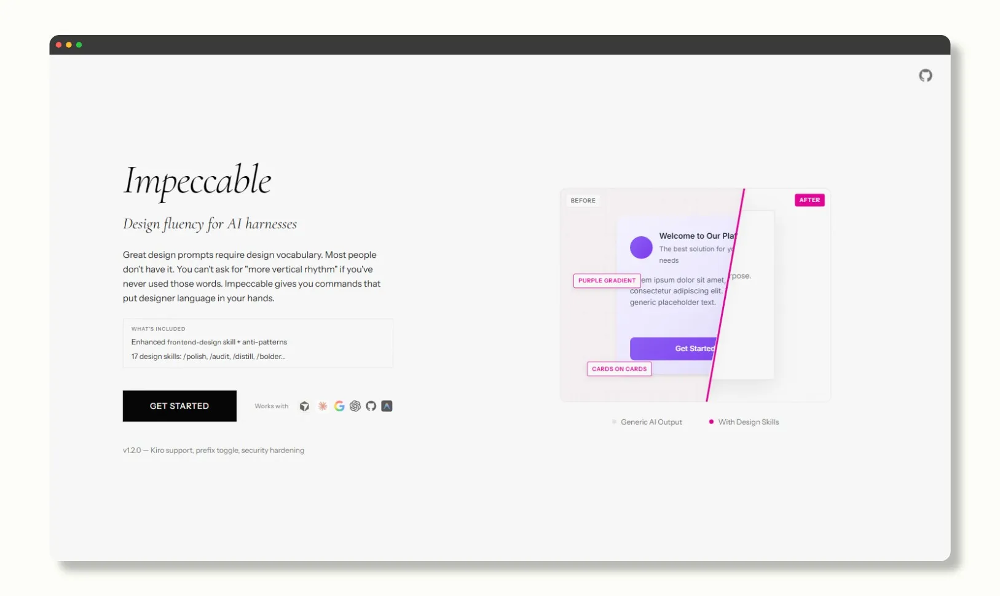
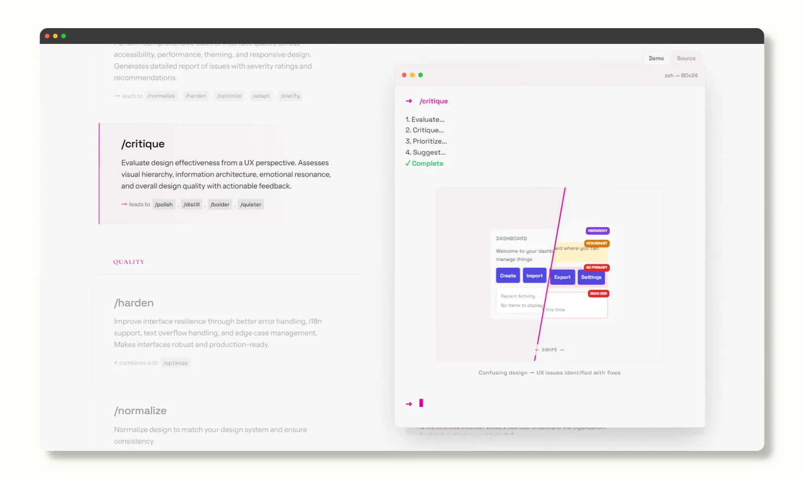
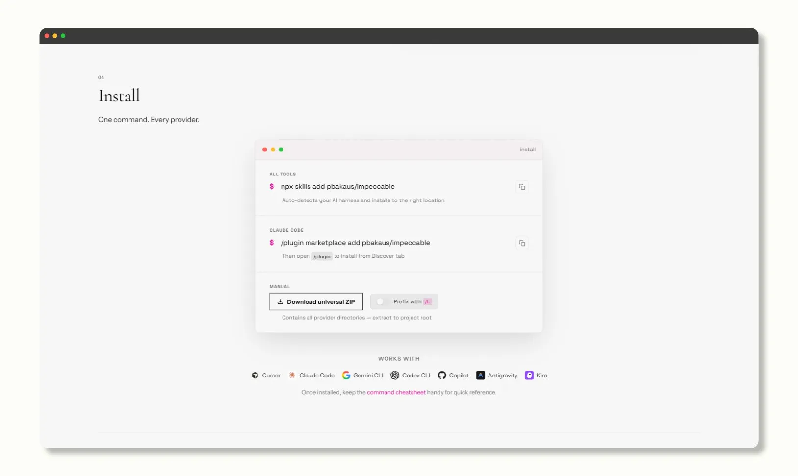

Impeccable.style 是一个专为 AI 编码工具（特别是 Anthropic 的 Claude）设计的 前端设计增强技能包（design skill / prompt framework）。它本质上是一套"设计语言 + 指令系统"，旨在大幅提升 AI 生成的网页界面（UI/前端代码）的审美水平和专业度。通过这套工具，AI 生成的界面不再带有明显的"AI 生成"痕迹，而是更接近优秀人类设计师的作品。

- 作者：Paul Bakaus（一位知名的前端/设计工具开发者）。
- 基础：基于 Anthropic 官方的 "frontend-design" skill 进一步深度强化。
- 发布日期：2026 年 2 月 28 日发布 v1.0.0；最新版本 v1.2.0（2026 年 3 月 5 日更新，包括新增 Kiro 支持、统一命令架构和 prefix toggle 恢复）。
- 适用环境：Cursor、Claude Code、Gemini CLI、Codex CLI、Copilot、Antigravity、Kiro 等支持自定义 skill 的环境中使用。
- 官网：https://impeccable.style（官网界面本身也使用这套规则设计）。

核心卖点：让 Claude 等大模型的前端审美从"及格"升级到"优秀/高级"。 它通过在 prompt 中加入特定指令，从设计师的视角触发多角度的审核分析设计，从而执行更高级的设计决策, 而不是简单堆砌 Tailwind / CSS 等样式。



## 主要作用

Impeccable.style 的主要作用是通过一套预定义的指令系统，提升 AI 在前端设计中的表现。具体来说：

- **设计决策自动化**：用户可以在 prompt 中添加指令（如 /polish），AI 会根据 Impeccable 的规则体系自动调整代码和设计方向。
- **界面优化**：从审美、一致性、性能到用户体验的多维度提升。
- **简化工作流**：开发者无需从零学习复杂设计原理，只需记住并组合指令，即可生成高质量界面。

示例使用：在 prompt 结尾添加指令组合，例如：

```
/polish + /distill + /animate
```

AI 就会按照这些规则精炼界面。

目前，Impeccable.style 提供 17 个核心设计指令（类似设计专用 DSL），这些指令覆盖从审计到优化的各种设计阶段，帮助用户快速迭代界面设计。



## 优势

相比原生 Claude / GPT 或普通 Tailwind prompt，Impeccable.style 具有显著优势。它能让 AI 生成的前端代码在审美水平上从中等偏下、常带"AI味"的状态，提升到中高级，接近优秀独立设计师的水准，这也是它的最大卖点，能有效避免生硬的设计感。

在设计决策深度方面，原生工具往往停留在比较表面的层面，而 Impeccable.style 引入了系统性思考，能够主动避免 anti-patterns 等常见雷区，让 AI 更智能地理解"为什么不该这么做"。

一致性是另一个亮点，原生生成的前端代码经常出现前后矛盾的问题，但 Impeccable.style 通过强制执行同一套设计语言，确保项目整体更统一。字体、间距和颜色这些细节，并且提供搭配和微调建议，详细的文字描述和精准的设计落点是提升效果好的最明显的几个原因。

动效方面，Impeccable.style 对于 motion 效果比较克制，减少过于侵略性的设计来保持设计质感，这一点我觉得很必要。在使用难度上，Impeccable.style 分门别类提供了 17 个不同用途的命令，简单了解即可上手，没有什么使用门槛。

简单来说，如果你使用 Claude / Cursor 等工具编写前端代码，但总是觉得生成的界面"差点味道"或太"AI 化"，Impeccable.style 是截至目前我使用测试过，生成效果最佳和最全面的的设计 Skills。值得一试。

## 所有设计指令

Impeccable.style 提供 17 个核心设计指令，每个指令都有特定功能。以下是完整列表，包括指令名称和简要描述：

- **/audit** — 执行全面界面质量审计，涵盖可访问性、性能、主题化和响应式设计。生成详细报告，包括问题严重性评级和推荐解决方案。
- **/critique** — 从 UX 视角评估设计有效性。检查视觉层次、信息架构、情感共鸣和整体设计质量，提供可操作反馈。
- **/normalize** — 标准化设计以匹配你的设计系统，确保一致性。
- **/polish** — 发布前的最终质量检查。修复对齐、间距、一致性和细节问题，将"好"提升到"优秀"。
- **/optimize** — 优化界面性能，包括加载速度、渲染、动画、图像和包大小。使体验更快、更流畅。
- **/harden** — 提升界面韧性，通过更好的错误处理、国际化支持、文本溢出管理和边缘案例处理。使界面更健壮、生产就绪。
- **/clarify** — 改进不清晰的 UX 文案、错误消息、微文案、标签和说明。使界面更容易理解和使用。
- **/distill** — 将设计精炼到本质，去除不必要的复杂性。优秀设计应简单、强大且干净。
- **/adapt** — 适应设计以适用于不同屏幕尺寸、设备、上下文或平台。确保跨环境的一致体验。
- **/animate** — 审视功能并通过有目的的动画、微交互和运动效果增强它，提升可用性和愉悦感。
- **/colorize** — 为单调或缺乏视觉兴趣的功能添加战略性颜色。使界面更吸引人和富有表现力。
- **/delight** — 添加喜悦、个性和意外惊喜的时刻，使界面难忘且愉快。将功能性提升到愉悦性。
- **/bolder** — 放大安全或乏味的设计，使其更具视觉趣味和刺激性。在保持可用性的前提下增加冲击力。
- **/quieter** — 降低过于大胆或视觉侵略性的设计强度。在保持设计质量和影响力的前提下减少强度。
- **/extract** — 提取并整合可复用组件、设计令牌和模式到你的设计系统中。识别系统化复用的机会，丰富组件库。
- **/teach-impeccable** — 一次性设置，收集项目设计上下文并保存到 AI 配置文件中。运行一次以建立持久设计指南。
- **/onboard** — 启用设计工作流的入门过程，帮助用户快速融入 Impeccable 的使用流程。

注意：这些指令可以组合使用，以实现更复杂的优化。例如，`/audit + /polish` 可以先审计问题再进行精修。指令列表基于官网内容，可能随版本更新而变化。

## 如何使用

- **安装/集成**：访问 https://impeccable.style 下载 skill 包，并添加到你的 AI 工具（如 Claude 或 Cursor）中。

推荐方式：在终端运行 `$ npx skills add pbakaus/impeccable`（自动安装并配置）。

- **Claude Code 专用**：使用 `/plugin marketplace add pbakaus/impeccable`，然后在 /plugin 面板的 Discover 标签中完成安装。

- **手动方式**：下载通用 ZIP 文件，从官网提取到项目根目录（例如 `.cursor/`、`.claude/`、`.gemini/`、`.codex/` 或 `.agents/` 文件夹）。



- **在 Prompt 中应用**：描述你的界面需求后（如"设计一个基于 Tailwind CSS 的登录页面"），在末尾添加指令组合。AI 会根据 Impeccable 的规则自动优化。

示例 Prompt：

```
设计一个登录页面，使用 Tailwind CSS。/distill + /bolder + /animate
```

（这个组合会执行精炼设计、增加大胆冲击力的视觉细节，并添加克制的动效。）

- **最佳实践**：
  - 新手建议从简单指令开始（如 /polish 或 /distill），熟悉后再逐步组合复杂指令（如 /audit + /polish 先审计再精修）。
  - 项目初始化时，运行 /teach-impeccable 指令，配置项目专属设计上下文，确保后续设计输出的一致性。
  - 测试时，使用真实设备而非仅模拟器；采用内容驱动的断点；确保触控目标至少 44x44px；避免在移动端隐藏核心功能；保持跨上下文的信息架构一致；应用渐进增强和响应式图像。
  - 若想快速了解工具效果，可直接访问官网的 cheatsheet 查看指令速查表，或浏览 demo 示例。

## 最后

Impeccable.style 的设计思路值得借鉴，无需专业设计基础，借助当前不断强大的模型，即可让开发者轻松创建专业级前端界面。如果你经常使用 AI 工具编写前端代码，追求高效、高质量的设计输出，这款工具绝对值得尝试！
